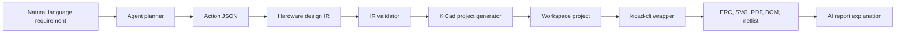

# Architecture

AI Hardware Design Studio is split into four layers:

1. Desktop UI
2. Agent orchestration
3. Structured hardware design IR
4. Deterministic generators and external tool wrappers

The key design rule is that the AI does not directly author complex KiCad files. It proposes structured actions and IR edits. Python generator code turns IR into reproducible KiCad project artifacts. Tool wrappers run `kicad-cli` when available and return friendly diagnostics when it is missing.

## Components

### Desktop App

`apps/desktop` is a Tauri + React shell. V1 is a mock UI with project explorer, schematic preview placeholder, architecture view, IR JSON viewer, AI chat, agent actions, reports, logs, BOM, netlist, and export status.

### Agent

`packages/agent` defines action schemas and planners. The planner emits JSON actions such as `generate_design_ir`, `validate_ir`, `generate_kicad_schematic`, and `run_erc`.

### Core IR

`packages/core` owns the JSON schema and validators. The IR captures requirements, blocks, power tree, connections, and design rules.

### Generator

`packages/generator` turns validated IR into deterministic project files. V1 uses mock KiCad schematic output that is intentionally simple. Future versions should move formatting into templates and symbol placement logic.

### Tools

`packages/tools` wraps external commands. The UI, agent, and generator should not call `kicad-cli` directly.

## Data Flow

## V1 Non-goals

- No full PCB editor
- No general layout automation
- No complete KiCad file authoring by AI
- No heavy part database integration
- No complex simulation stack
